# Architecture & Diagrams — Kapruka Gift Concierge

This document contains comprehensive architectural diagrams for the Kapruka Gift Concierge system. For a high-level overview, see the [main README](./README.md).

---

## Table of Contents

1. [High-Level System Architecture](#1-high-level-system-architecture)
2. [Multi-Agent Orchestration Flow](#2-multi-agent-orchestration-flow)
3. [Router Decision Logic](#3-router-decision-logic)
4. [Reflection Safety Loop (Detailed)](#4-reflection-safety-loop-detailed)
5. [Memory Architecture](#5-memory-architecture)
6. [Hybrid RAG Pipeline](#6-hybrid-rag-pipeline)
7. [Hybrid Search Architecture (Qdrant)](#7-hybrid-search-architecture-qdrant)
8. [Data Ingestion Pipeline](#8-data-ingestion-pipeline)
9. [Class & Component Interaction Map](#9-class--component-interaction-map)
10. [Full Request Lifecycle (End-to-End)](#10-full-request-lifecycle-end-to-end)
11. [Technology Stack Breakdown](#11-technology-stack-breakdown)

---

## 1. High-Level System Architecture

A complete overview of every layer — from the Next.js frontend through FastAPI, the agent orchestration layer, memory systems, and external APIs.

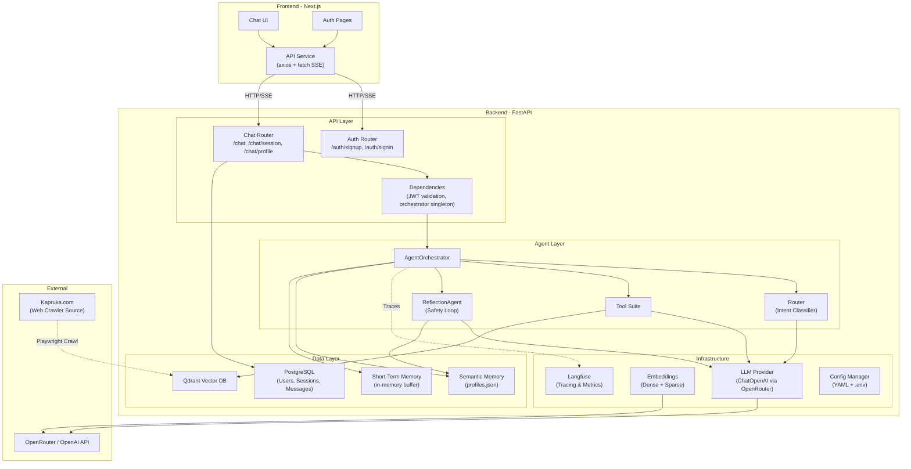

---

## 2. Multi-Agent Orchestration Flow

The core `AgentOrchestrator.chat()` method implements a **route → parallel execute → reflect** pipeline.

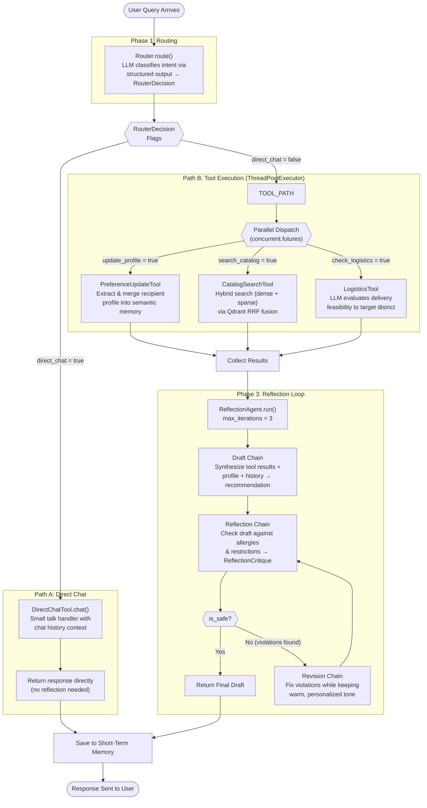

### Key Design Decisions

- **Parallel tool execution**: Profile update, catalog search, and logistics check run simultaneously in a `ThreadPoolExecutor`, reducing latency when multiple tools are needed.
- **Mutual exclusion**: `direct_chat` is mutually exclusive with catalog/logistics tools — if the user is just chatting, no heavy tools are invoked.
- **Profile update is fire-and-forget**: It runs in parallel but its result isn't used in the current response — it updates semantic memory for *future* queries.

---

## 3. Router Decision Logic

The Router is the **brain** of the system — an LLM-powered intent classifier that outputs structured JSON via `with_structured_output(RouterDecision)`.

```mermaid
flowchart LR
    INPUT["User Query +<br/>Semantic Profile +<br/>Chat History"]
    
    INPUT --> LLM_CALL["LLM with Structured Output<br/>(RouterDecision schema)"]
    
    LLM_CALL --> OUTPUT

    subgraph OUTPUT ["RouterDecision - Pydantic Schema"]
        direction TB
        F1["update_profile: bool<br/><i>New preferences/allergies?</i>"]
        F2["search_catalog: bool<br/><i>Wants gifts/recommendations?</i>"]
        F3["check_logistics: bool<br/><i>Delivery question?</i>"]
        F4["direct_chat: bool<br/><i>Small talk only?</i>"]
        F5["target_location: str | null<br/><i>District/City for logistics</i>"]
        F6["vector_query: str<br/><i>Semantic search query</i>"]
        F7["keyword_query: str<br/><i>BM25 keyword query</i>"]
    end
```

### Router Prompt Intelligence

The router prompt contains sophisticated instructions:
- **vector_query**: Enriched with recipient's preferences for semantic relevance
- **keyword_query**: Compressed keywords that *exclude* "gifts" and *exclude* recipient's allergies (pre-filtering unsafe items at search time)
- **Mutual exclusion**: When `direct_chat = true`, other flags are generally `false`

---

## 4. Reflection Safety Loop (Detailed)

The ReflectionAgent implements a **critique-and-revise loop** — a key safety mechanism that ensures no allergy-violating recommendations reach the user.

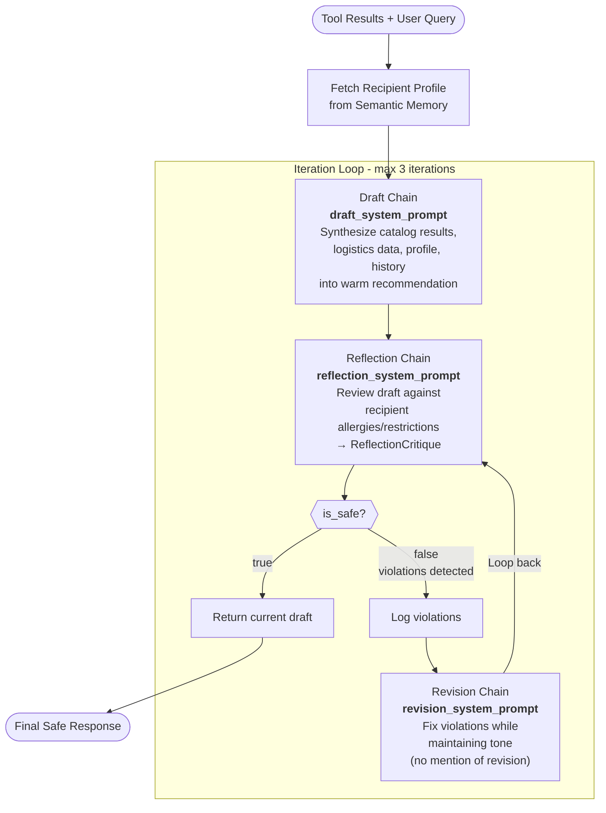

### Three Distinct LLM Chains in the Loop

| Chain | Prompt | Input | Output |
|---|---|---|---|
| **Draft** | `draft_system_prompt` + `draft_user_prompt` | query, tool_results, profile, chat history | Natural language recommendation |
| **Reflection** | `reflection_system_prompt` + `reflection_user_prompt` | proposed recommendation, profile | `ReflectionCritique` (is_safe, violations) |
| **Revision** | `revision_system_prompt` + `revision_user_prompt` | current draft, violation list | Revised recommendation |

---

## 5. Memory Architecture

The system uses a **dual-memory architecture** — long-term semantic memory for user profiles and short-term buffer memory for conversation context.

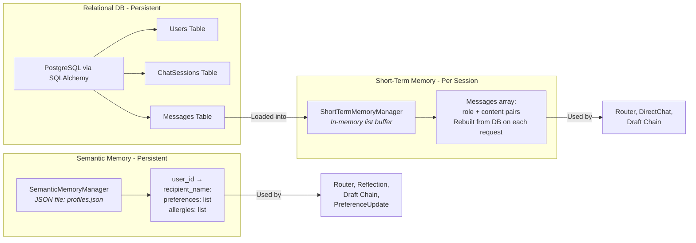

### Memory Flow Per Request

1. **Load**: Previous messages for the session are loaded from PostgreSQL → `ShortTermMemoryManager`
2. **Use**: Router and tools read from both memory types
3. **Update**: After response, new user/assistant messages are added to both short-term buffer and PostgreSQL
4. **Profile Update**: `PreferenceUpdateTool` may asynchronously update semantic memory (profiles.json)

---

## 6. Hybrid RAG Pipeline

The system implements a **Hybrid Retrieval-Augmented Generation (RAG)** pipeline. Unlike monolithic RAG systems, the retrieval and generation phases are distributed across two separate agent components, connected through the orchestrator.

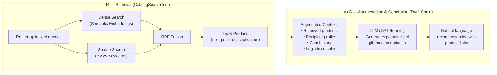

### RAG Phase Mapping

| RAG Phase | Component | Implementation Details |
|---|---|---|
| **Retrieval** | `CatalogSearchTool` → Qdrant | Hybrid search combining dense (semantic cosine similarity) and sparse (BM25 keyword matching) via Reciprocal Rank Fusion. Returns top-5 products with title, description, price, URL, and availability. |
| **Augmentation** | `ReflectionAgent.run()` | The retrieved products are combined with the recipient's semantic profile (preferences/allergies), the session's chat history, and any logistics feasibility results into a rich, multi-source context. |
| **Generation** | Draft Chain (LLM) | The LLM (GPT-4o-mini) synthesizes the augmented context into a warm, personalized gift recommendation. The response includes real product URLs — the LLM never hallucinate product names or prices because it is grounded in retrieved catalog data. |

---

## 7. Hybrid Search Architecture (Qdrant)

The catalog search uses **Reciprocal Rank Fusion (RRF)** to combine dense semantic search with sparse keyword (BM25) search.

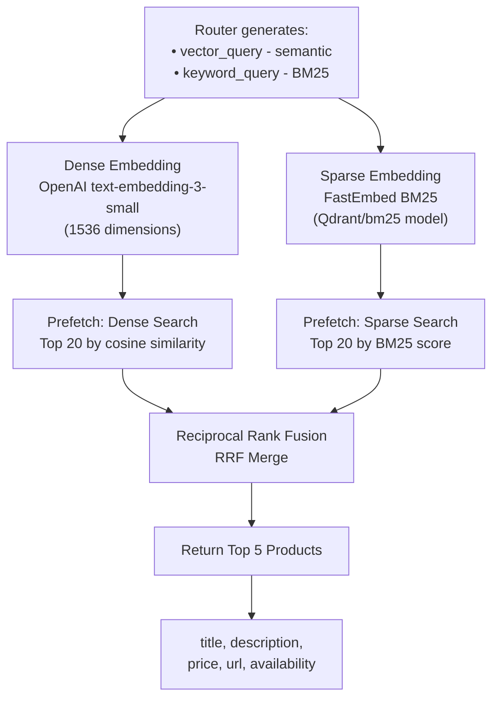

### Why Hybrid Search?

| Search Type | Strength | Weakness |
|---|---|---|
| **Dense (Semantic)** | Understands meaning, synonyms, intent | May miss exact keyword matches |
| **Sparse (BM25)** | Exact keyword matching, product names | Misses semantic similarity |
| **Hybrid (RRF)** | Best of both worlds | Slightly more compute |

The `keyword_query` is intelligently crafted by the Router to **exclude allergens** and **exclude the word "gifts"** (which would dilute search results), while the `vector_query` is enriched with recipient preferences for personalized semantic matching.

---

## 8. Data Ingestion Pipeline

The pipeline scrapes product data from Kapruka.com, generates dual embeddings, and indexes everything into Qdrant.

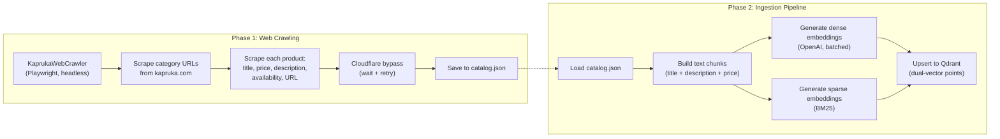

### Each Qdrant Point Contains

| Field | Type | Description |
|---|---|---|
| **Dense vector** | `float[1536]` | Semantic representation of product text |
| **Sparse vector** | BM25 | Keyword-based representation |
| **Payload: title** | `string` | Product name |
| **Payload: description** | `string` | Product description |
| **Payload: price** | `string` | Product price |
| **Payload: url** | `string` | Product page URL on Kapruka.com |
| **Payload: availability** | `bool` | Whether the product is in stock |

---

## 9. Class & Component Interaction Map

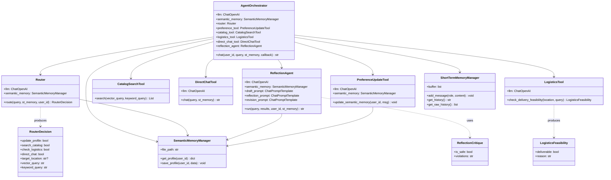

---

## 10. Full Request Lifecycle (End-to-End)

The complete journey of a single user message through every layer of the system.

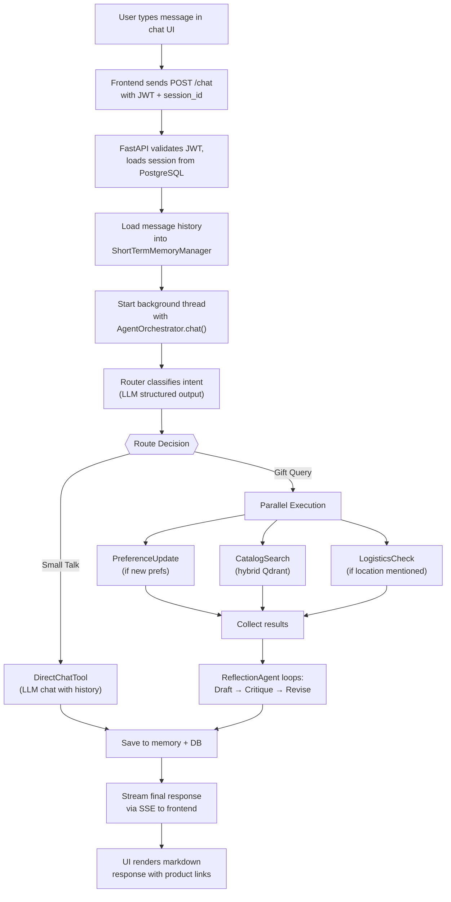

---

## 11. Technology Stack Breakdown

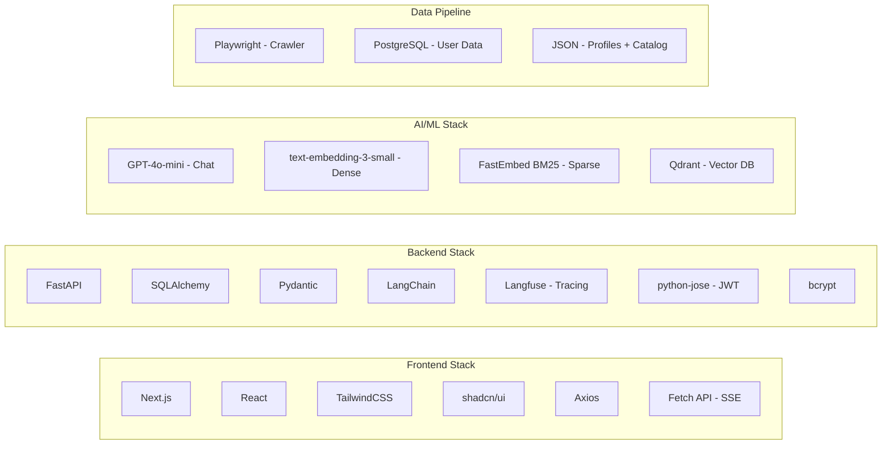

| Layer | Technology | Purpose |
|---|---|---|
| **Frontend** | Next.js + React | Server-side rendered chat UI |
| **Styling** | TailwindCSS + shadcn/ui | Utility-first CSS with accessible components |
| **HTTP Client** | Axios + Fetch API | REST calls + SSE streaming |
| **Backend API** | FastAPI | Async Python web framework |
| **ORM** | SQLAlchemy | Database abstraction for PostgreSQL |
| **Validation** | Pydantic | Request/response schema validation |
| **Auth** | python-jose + bcrypt | JWT tokens + password hashing |
| **Agent Framework** | LangChain | Prompt templates, chains, structured output |
| **Observability** | Langfuse | End-to-end tracing of agent and LLM execution |
| **Chat LLM** | GPT-4o-mini (OpenRouter) | Intent classification, chat, recommendations |
| **Dense Embeddings** | text-embedding-3-small | 1536-dim semantic vectors |
| **Sparse Embeddings** | FastEmbed BM25 | Keyword-based sparse vectors |
| **Vector Database** | Qdrant (local) | Hybrid search with RRF fusion |
| **Relational DB** | PostgreSQL | User accounts, sessions, message persistence |
| **Web Scraping** | Playwright | Automated Kapruka.com product crawling |
