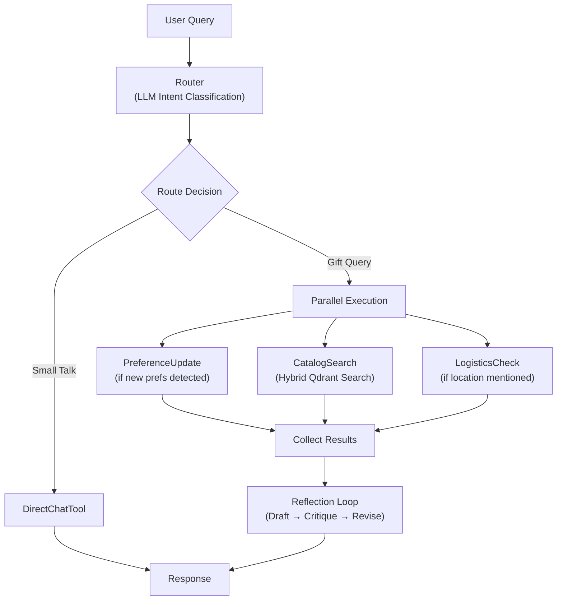
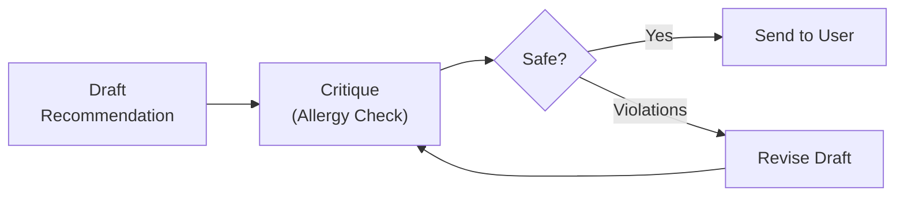
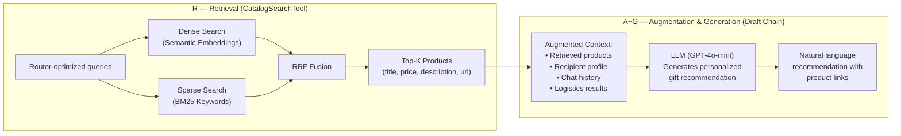
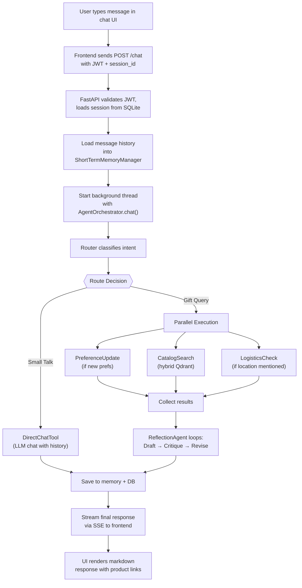

# Kapruka Gift Concierge

An AI-powered gift recommendation chatbot built for [Kapruka](https://www.kapruka.com), Sri Lanka's premier e-commerce platform. The system uses **multi-agent orchestration** with LLM-driven routing, hybrid vector search, a reflection-based safety loop, and dual-memory architecture to deliver personalized, allergy-safe gift recommendations.

---

## Key Features

- **Multi-Agent Orchestration** — An intent router dispatches user queries to specialized tools (catalog search, logistics, profile update, direct chat) in parallel.
- **Reflection-Based Safety Loop** — A critique-and-revise loop (up to 3 iterations) validates recommendations against recipient allergies and restrictions before delivery.
- **Hybrid Search (RRF)** — Combines dense semantic search (OpenAI embeddings) with sparse keyword search (BM25) via Reciprocal Rank Fusion in Qdrant for superior product retrieval.
- **Dual Memory Architecture** — Persistent semantic memory (recipient profiles with preferences/allergies) + in-session short-term memory for conversational context.
- **Real-Time Streaming** — Server-Sent Events (SSE) stream live status updates to the frontend during agent processing.
- **Automated Data Pipeline** — Playwright-based web crawler scrapes Kapruka.com product catalogs, which are then embedded and indexed into Qdrant.

---

## System Architecture

```
kapruka-gift-concierge/
├── backend/                 # FastAPI + LangChain agent system
│   ├── config/              # YAML configuration (models, parameters)
│   ├── data/                # Qdrant DB, catalog JSON, user profiles
│   ├── notebooks/           # Jupyter notebooks for experimentation
│   └── src/
│       ├── agents/          # Core agent layer (orchestrator, router, reflection, tools)
│       ├── api/             # FastAPI app (routers, schemas, auth, DB models)
│       ├── db/              # Qdrant vector DB client
│       ├── infrastructure/  # LLM provider, embeddings, config loader
│       ├── memory/          # Semantic & short-term memory managers
│       └── services/        # Web crawler & data ingestion pipeline
│
└── frontend/                # Next.js chat interface
    ├── app/                 # Pages (chat, login)
    ├── components/          # UI components (chat, sidebar)
    ├── context/             # Auth context provider
    ├── lib/                 # Utility functions
    └── services/            # API service layer (axios + SSE)
```

---

## Multi-Agent Orchestration Flow



**How it works:**

1. **Route** — The Router (LLM with structured output) classifies the user's intent and sets boolean flags: `search_catalog`, `check_logistics`, `update_profile`, or `direct_chat`.
2. **Execute** — Flagged tools run in parallel via `ThreadPoolExecutor`. The catalog search uses hybrid (dense + sparse) retrieval with RRF fusion in Qdrant.
3. **Reflect** — The ReflectionAgent drafts a recommendation, then a safety reviewer checks it against the recipient's allergies. If violations are found, it revises the draft (up to 3 iterations).
4. **Stream** — Status updates are streamed to the frontend via SSE throughout the process.

---

## Reflection Safety Loop



The reflection loop ensures that no recommendation violates the recipient's known allergies or restrictions. The system pre-filters allergens at the search query level (Router removes allergens from `keyword_query`) and post-validates at the output level (ReflectionAgent critique).

---

## Hybrid RAG Pipeline

The system implements a **Hybrid Retrieval-Augmented Generation (RAG)** pipeline, where the retrieval and generation phases are distributed across two separate agent components:



| RAG Phase | Component | What It Does |
|---|---|---|
| **Retrieval** | `CatalogSearchTool` → Qdrant | Hybrid search (dense cosine + sparse BM25) merged via Reciprocal Rank Fusion. Returns top-5 products. |
| **Augmentation** | `ReflectionAgent.run()` | Combines retrieved products with the user's semantic profile, chat history, and logistics results into a rich context. |
| **Generation** | Draft Chain (LLM) | The LLM synthesizes the augmented context into a warm, personalized gift recommendation with product URLs. |

---

## Full Request Lifecycle (End-to-End)



**Step-by-step:**

1. **User Input** — The user types a message in the Next.js chat UI.
2. **API Request** — The frontend sends a `POST /chat` request with a JWT token and session ID via `fetch` (for SSE streaming).
3. **Auth & Session** — FastAPI validates the JWT, loads the chat session from SQLite, and rebuilds the conversation history into a `ShortTermMemoryManager`.
4. **Background Processing** — A background thread starts the `AgentOrchestrator.chat()` method. Status callbacks push updates to a `Queue`, which the main thread streams as SSE events.
5. **Routing** — The Router (LLM with structured output) classifies intent into a `RouterDecision` — setting flags like `search_catalog`, `check_logistics`, `update_profile`, or `direct_chat`.
6. **Tool Execution** — Flagged tools run in parallel. Catalog search uses hybrid retrieval (dense + sparse → RRF fusion). Logistics uses LLM reasoning about distance/perishability. Profile updates merge new preferences into semantic memory.
7. **Reflection** — The ReflectionAgent drafts a recommendation, critiques it against the recipient's allergies, and revises if needed (up to 3 iterations).
8. **Response** — The final response is streamed to the frontend, saved to both short-term memory and SQLite, and rendered as markdown in the chat UI.

---

## Technology Stack

| Layer | Technology |
|---|---|
| **Frontend** | Next.js, React, TailwindCSS, shadcn/ui, Axios |
| **Backend API** | FastAPI, SQLAlchemy, Pydantic, python-jose (JWT), bcrypt |
| **Agent Framework** | LangChain (prompts, chains, structured output) |
| **LLM** | OpenAI GPT-4o-mini (via OpenRouter) |
| **Embeddings** | Dense: OpenAI `text-embedding-3-small` (1536-dim), Sparse: FastEmbed BM25 |
| **Vector Database** | Qdrant (local persistent storage) |
| **Relational DB** | SQLite (users, sessions, messages) |
| **Data Pipeline** | Playwright (web scraping), custom ingestion pipeline |
| **Streaming** | Server-Sent Events (SSE) |

---

## Quick Start

### Prerequisites

- Python 3.12+
- [uv](https://docs.astral.sh/uv/) (Python package manager)
- Node.js 20.9+
- An [OpenRouter](https://openrouter.ai/) API key (or OpenAI API key)

### 1. Backend Setup

```bash
cd backend

# Install dependencies
uv sync

# Configure environment
cp .env.sample .env
# Edit .env and add your OPENROUTER_API_KEY

# Run data ingestion (first time only)
uv run python -m src.services.ingest_service.pipeline

# Start the API server
uv run uvicorn src.api.main:app --reload
```

### 2. Frontend Setup

```bash
cd frontend

# Install dependencies
npm install

# Configure environment
cp .env.sample .env
# Edit .env and set NEXT_PUBLIC_API_BASE_URL=http://localhost:8000

# Start the dev server
npm run dev
```

### 3. Open the App

Navigate to `http://localhost:3000`, sign up, and start chatting with the Gift Concierge!

---

## Project Structure

| Directory | Description |
|---|---|
| [`backend/`](./backend/) | FastAPI server, LangChain agents, Qdrant integration, data pipeline |
| [`frontend/`](./frontend/) | Next.js chat UI with auth, sidebar, and real-time streaming |

See the individual README files in each directory for detailed documentation.

**For comprehensive architectural diagrams** (class diagrams, memory architecture, and more), see **[ARCHITECTURE.md](./ARCHITECTURE.md)**.

---

## Configuration

The backend uses YAML-based configuration for flexible LLM and embedding model selection:

- **`config/param.yaml`** — LLM provider, tier, temperature, max tokens, Qdrant collection name
- **`config/models.yaml`** — Model registry with tiers (general, strong, reason) for OpenRouter and OpenAI
- **`.env`** — API keys (`OPENROUTER_API_KEY`)

Switching LLM providers or models requires only a config change — no code modifications.

---

